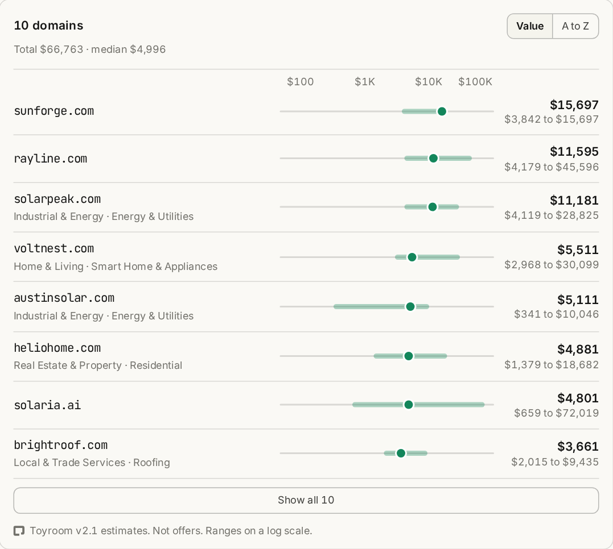

# Toyroom for Claude

Domain name research inside Claude, from [toyroom.ai](https://toyroom.ai). Ask what a domain is worth, which name ideas are already registered, how crowded a keyword is, or how a list of names breaks down by industry. Answers arrive as cards in the conversation, in light and dark mode, on desktop and phone.

## What's inside

- **The Toyroom connector** at `https://api.toyroom.ai/mcp/open`. Five read-only tools. No account and no API key.
- **Two skills** that teach Claude the workflow: `domain-name-research` for naming and checking ideas, and `domain-portfolio-review` for a list of domains you own or want to buy.

## Try it

- What is bakery.ai worth? Is "bakery" registered in other extensions too?
- I am naming a solar installer in Austin. Suggest ten short .com names, check which are already registered, and appraise the rest.
- How crowded is the keyword "robot" compared with "droid"? Count registered domains for each, overall and in .com and .ai.
- Sort these by industry: tacoloco.com, coffeebeans.shop, petvet.ai, lawfirm.io, cloudbackup.io, ledgerly.io.

## Tools

| Tool | What it does |
| --- | --- |
| `appraise_domain` | Estimated value of one domain in USD, with a low and high range, from Toyroom's model trained on real aftermarket sales. |
| `appraise_bulk` | Estimates for up to 25 domains, ranked. |
| `zone_lookup` | Whether up to 100 domains are registered, and how many extensions each name is registered under. Country-code extensions are only partly covered, so a missing name there shows as unknown. |
| `zone_count` | How many registered domains contain, start with, or end with a keyword of 3+ characters, across 390M+ domains or in the extensions you pick. |
| `categorize_domains` | Industry and subcategory for up to 25 domains. |

"Registered" means present in a daily zone file. It is not a live availability check, so confirm with a registrar before you count on a name. Appraisals are model estimates, not offers.

## Limits

Free, with a daily allowance per connection that resets at 00:00 UTC. For higher limits, bulk jobs, RDAP, and DNS, use the API with a key: [api.toyroom.ai](https://api.toyroom.ai).

## Data

The plugin sends the domain names and keywords in each tool call to api.toyroom.ai. It never sends your conversation, files, or memory. Toyroom keeps a keyed, daily-changing hash of the caller's IP address to enforce the allowance (live for 26 hours; nightly backups keep copies for up to 60 days), and web server logs record each request's IP address, time, and request line. Details: [toyroom.ai/privacy](https://toyroom.ai/privacy#api).

## Support

feedback@toyroom.ai
